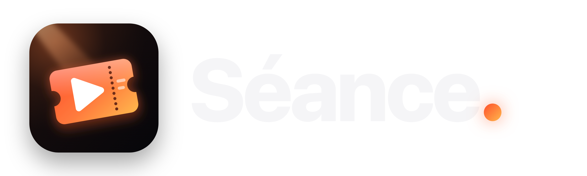
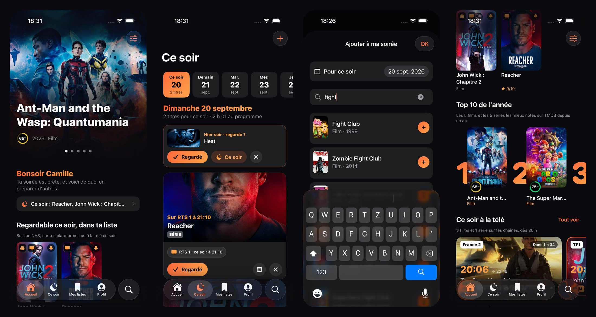
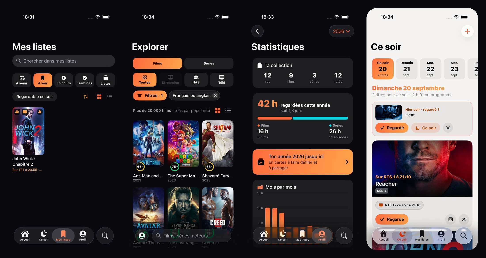
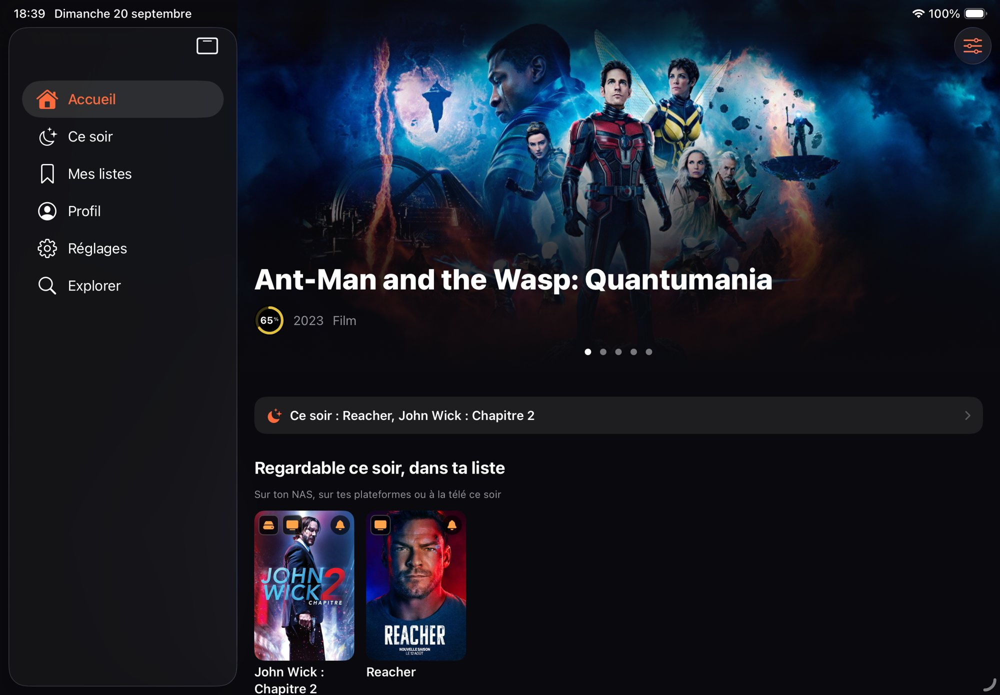
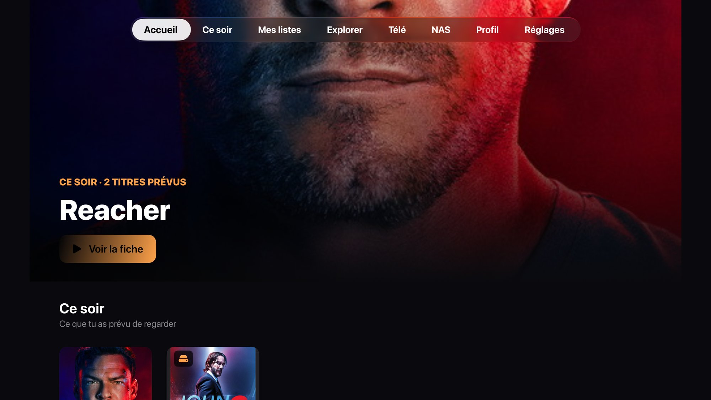
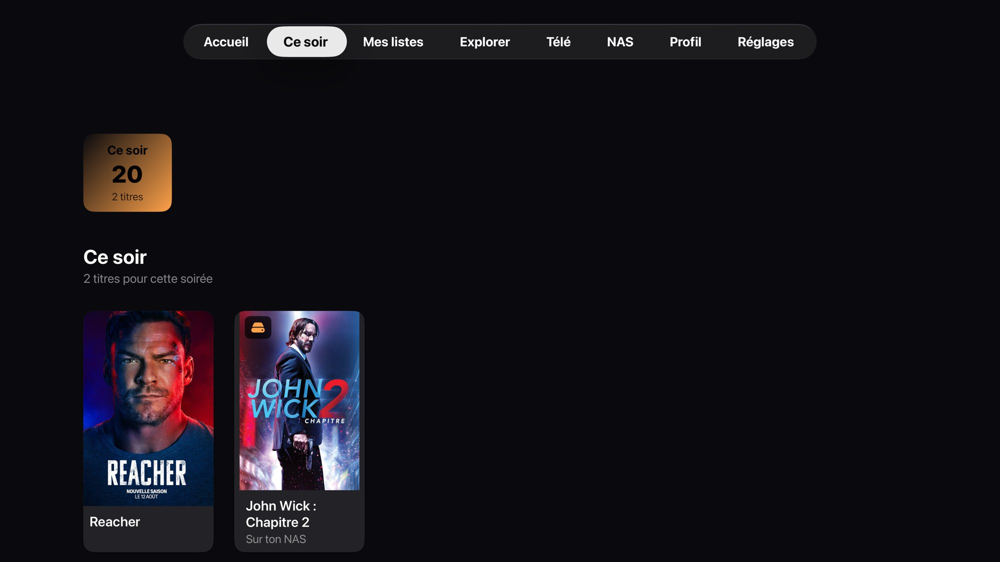

<p align="center">
  
</p>

# Séance

**« Qu'est-ce que je regarde ce soir, et où ? »** Séance est une app personnelle pour les films et les séries,
pensée pour la Suisse romande : elle dit **où regarder** chaque titre — sur ton NAS, sur les plateformes auxquelles
tu es abonné, ou à la télévision avec la chaîne, le jour et l'heure — et elle t'aide à organiser ta soirée.

Une seule app, quatre appareils Apple : **iPhone, iPad, Mac et Apple TV**. Tout reste chez toi : pas de compte,
pas de serveur, pas de publicité. Les données vivent sur tes appareils et se synchronisent par un dossier d'iCloud Drive
et par un dossier du NAS — c'est par lui que l'Apple TV reçoit tes listes.

<p align="center">
  
</p>

## Ce que fait Séance

| | |
|---|---|
| **Où regarder, tout de suite** | Sur chaque titre : « Lire sur le NAS » lance la vidéo dans Séance même — AVI, WMV, MKV, DV et MJPEG compris, grâce au moteur de VLC (sur le Mac, Infuse ou VLC prennent le relais pour ce que macOS ne lit pas) ; « Netflix », « Apple TV » et « Disney+ » ouvrent le titre lui-même (identifiants tirés de Wikidata, sans clé), les autres plateformes leur recherche ; un passage en direct s'ouvre dans l'app blue TV, sur l'émission en cours. Un sablier dit ce que Séance attend, et jamais plus de deux secondes et demie. Seuls **tes** abonnements comptent ; un titre qui n'est que sur une plateforme où tu n'es pas abonné le dit, au lieu de se faire introuvable. |
| **Streaming et télé, bien séparés** | Le streaming se regarde quand tu veux ; la télé (blue TV, antenne) passe à une date et une heure fixes. Séance ne mélange pas les deux. |
| **Ce soir** | Ta soirée en grandes cartes : un film, l'épisode suivant d'une série (le premier, si tu ne l'as jamais commencée), la durée totale. « Regardé », puis ta note. Une rangée de jours prépare les soirées à venir, avec un rappel le jour venu. |
| **Famille** | Un profil par personne — listes, notes, pouces, idées du soir — sur tous les appareils ; « Qui regarde ce soir ? » mêle les goûts de plusieurs pour proposer ce qui plaît à tous, et « Vu avec qui ? » inscrit un film vu ensemble chez chacun. Le foyer (plateformes, chaînes, NAS, clés) est commun. |
| **👍 👎 et suggestions** | Un pouce levé ou baissé, comme sur Netflix, sans avoir vu le titre ; la note de 1 à 10 vient après. « Suggestions pour toi », sur la page Ce soir, part d'abord des acteurs que tu suis, puis de tes pouces et de tes notes. |
| **Des idées selon tes goûts** | Des titres regardables sur tes plateformes, classés sur l'appareil d'après tes notes — ou par Claude si tu ajoutes une clé d'API, pour lire une envie (« un truc nerveux, pas trop long »). « Je n'aime pas » écarte un titre pour de bon ; les Réglages permettent de tout reproposer. |
| **Suivi des séries** | Épisode par épisode, « vu jusqu'ici », notes, prochain épisode, alertes à chaque épisode ou à chaque saison. |
| **Programme télé** | Les chaînes que tu choisis, en grandes cartes, avec une cloche pour être prévenu avant le début. |
| **NAS** | Ta bibliothèque de films et de séries lue en SMB, rattachée à TMDB — Films, Séries, NEW et Vidéos du même geste, rangés de quatre façons : alphabétique, par ajouts récents, par année ou par genre. Tes vidéos personnelles sont des **albums de souvenirs** : un dossier d'événement par album, la première image de la vidéo en couverture (ou une icône devinée d'après le nom, ou celle que tu choisis), rangés par année et cherchables ; elles se lisent dans Séance même, sans les copier, et le lecteur dit pourquoi quand un codec ne passe pas. |
| **Explorer** | Tout TMDB, tes plateformes, ton NAS ou la télé ; filtres par genre, période, note, acteur ; filtres enregistrés. |
| **Mes listes, statistiques, bilan de l'année** | À voir, en cours, terminés, listes nommées, à venir ; heures regardées, genres, acteurs. |
| **L'e-mail de la semaine** | Les jours que tu choisis — un ou plusieurs par semaine —, avec les seules rubriques qui t'intéressent : épisodes, sorties, passages à la TV (sur les chaînes que tu désignes), nouveautés de tes plateformes (celles que tu désignes), acteurs suivis, soirées prévues. En HTML aux couleurs de Séance, à plusieurs destinataires. Il part de ton appareil, par ton compte de messagerie (SMTP, port 465) ; le mot de passe passe d'un appareil à l'autre par le transfert chiffré, jamais par un fichier. |
| **Alertes** | Notifications locales sur l'iPhone — et l'Apple Watch quand il est verrouillé : épisodes, sorties, passages à la TV, nouveaux films et séries des acteurs suivis. Réglages › Alertes › « Alertes reçues » retrouve ce qui a été envoyé, et ce qui le sera. |
| **Widgets, Siri, raccourcis** | Le prochain épisode se coche depuis l'écran d'accueil ; « Qu'est-ce que je regarde ce soir avec Séance ? ». |
| **Accessibilité** | Texte très agrandi, VoiceOver, zones de toucher de 44 points, apparence sombre ou claire — vérifiés par des tests automatiques. |

<p align="center">
  
</p>

## Quatre appareils

### iPad et Mac

La même app, et depuis la 7.0 le même menu que l'Apple TV : Accueil, Ce soir, **Streaming**, **TV**, **NAS**, Mes listes, la
loupe d'Explorer et la roue dentée des réglages ; les Préférences s'ouvrent par le portrait, en haut à gauche. Sur l'iPhone, les
trois sources se partagent l'onglet « Regarder ». Sur le Mac (Mac Catalyst), des raccourcis clavier (⌘1 à ⌘9, ⌘F, ⌘,) et le clic droit sur une affiche
pour les actions rapides. Sur un Mac qui reste allumé, Séance peut devenir la **centrale de la maison** : elle synchronise, relit le guide et le NAS, et envoie l'e-mail de la semaine à l'heure, pour tous les appareils.

<p align="center">
  
</p>

### Apple TV

Une interface à part, faite pour la télécommande, aussi complète que celle de l'iPhone : le menu en haut de l'écran,
l'accueil en grande image, ta soirée et des idées, tes listes, le programme TV, le NAS et tes vidéos personnelles, la fiche
complète (où regarder, épisodes, pouces, note, casting) et la fiche des acteurs, et des réglages en grandes cartes. Les cartes portent
les mêmes logos de plateformes et de chaînes que sur l'iPhone, les questions se posent dans des pages de Séance (lisibles à trois
mètres), et l'historique des versions s'y lit aussi. La TV se configure depuis l'iPhone, par un code à six chiffres.

<p align="center">
  
  
</p>

Pour aller plus loin : la [présentation](Documentation/Séance%20—%20présentation.pptx), la
[fiche de présentation](Documentation/Séance%20—%20fiche%20de%20présentation.pdf), le
[cahier des exigences](Documentation/Séance%20—%20cahier%20des%20exigences.docx) et la
[charte graphique](Documentation/Charte%20graphique.md). L'historique des versions se lit dans l'app
(Réglages › Versions) et dans `Seance/Ecrans/Reglages/Versions.swift`.

## Sources de données

- **TMDB** : catalogue, affiches, plateformes par pays (données JustWatch), dates de sortie. Clé d'API personnelle, gardée dans le trousseau. Ce produit utilise l'API de TMDB mais n'est ni approuvé ni certifié par TMDB.
- **XML TV Fr** : programmes des chaînes, projet bénévole ; un téléchargement par jour.
- **API Claude** (facultative) : lecture de l'envie du soir et choix des idées. Sans clé, tout se classe sur l'appareil.
- **Ton NAS** : en SMB, sur le réseau de la maison ; les mots de passe restent dans le trousseau et ne voyagent jamais.

## Organisation du dépôt

| Dossier | Contenu |
| --- | --- |
| `SeanceKit/` | Le moteur, sans persistance ni dépendance : e-mail de la semaine (HTML, MIME, client SMTP), client TMDB et cache, critères d'Explorer, guide TV (XMLTV), rattachement à TMDB, goûts et recommandation, noms de fichiers du NAS, sauvegarde et fusion de synchronisation, liens vers les plateformes, trousseau. Se teste avec les seuls Command Line Tools. |
| `SeanceDonnees/` | Le modèle SwiftData (configurations « Utilisateur » et « Cache », sans CloudKit) et les services qui appliquent le moteur au magasin. Xcode requis (macros `@Model`). |
| `SeanceNAS/` | L'accès SMB (AMSMB2), à part pour que le moteur reste sans dépendance. |
| `Seance/` | L'app iPhone, iPad et Mac (Mac Catalyst). |
| `SeanceWidget/` | Les widgets. |
| `SeanceTV/`, `SeanceTVEtagere/` | L'app Apple TV et son étagère du haut (Top Shelf). |
| `SeanceUITests/` | Les tests d'interface, qui tournent sans clé ni réseau grâce aux données de démonstration et à un faux TMDB. |
| `project.yml` | La description du projet pour XcodeGen : `Seance.xcodeproj` est **généré**. |
| `outils/` | Les scripts ci-dessous. |
| `Documentation/` | Charte graphique, cahier des exigences, présentation, essais sur les appareils, logo, captures. |

## Commandes

```sh
outils/verifier.sh            # tout avant un commit : tests unitaires, interface iPhone puis iPad (10 à 15 min)
outils/verifier.sh --rapide   # sans les tests d'interface (une minute)
outils/tester.sh              # tests de SeanceKit, sans Xcode
outils/tests-interface.sh ParcoursSoireeTests   # un test d'interface (Classe ou Classe/test)
outils/generer-projet.sh      # régénère Seance.xcodeproj après modification de project.yml
outils/installer.sh           # Release sur iPhone, iPad, Apple TV et Mac ; ou --iphone, --ipad, --mac, --tv
outils/captures.sh            # captures du simulateur (captures-tv.sh pour l'Apple TV)
```

`CLAUDE.md` décrit l'architecture et les règles du projet pour qui y travaille avec Claude Code.

## Avant la première compilation

1. Xcode 27, licence acceptée : `sudo xcodebuild -license accept`. iOS, iPadOS, tvOS et macOS 26.
2. `outils/generer-projet.sh`, puis ouvrir `Seance.xcodeproj` et choisir son équipe dans Signing & Capabilities.
3. Si l'identifiant `ch.patrick.seance` est refusé, le remplacer dans `project.yml` (avec les groupes
   `group.ch.patrick.seance…`), puis régénérer le projet.
4. Au premier lancement, l'app demande une clé d'API TMDB (gratuite).

Avec un compte Apple gratuit, l'app installée cesse de s'ouvrir au bout de 7 jours : `outils/installer.sh` la
réinstalle, les données restent sur chaque appareil.

Dépôt : https://github.com/patrickpinard/Seance
